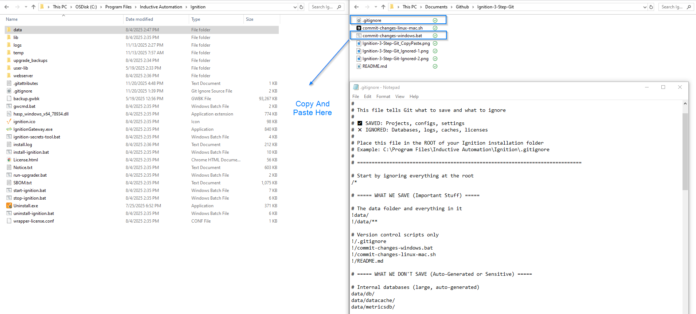
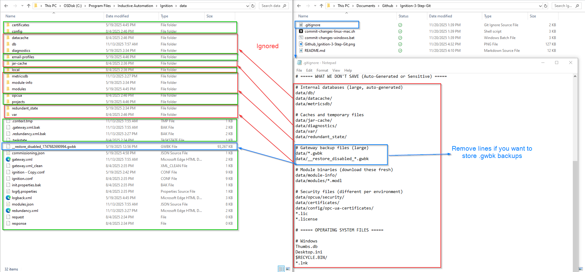

# Ignition Setup Guide - Git Version Control for Ignition

**Version 1.0.0** | Last Updated: November 20, 2025

> **📝 Note:** This README is designed to be customizable! Feel free to modify it to match your organization's specific setup, add your own examples, or include additional instructions relevant to your team.

**Simple drag-and-drop Git version control for Ignition 8.3**

## 🎯 It's This Simple: Drag & Drop 3 Files



**That's it!** Copy 3 files to your Ignition folder, run 4 commands, and you're done!

---

## 📁 What Gets Tracked vs. Ignored



✅ **Tracked:** Projects, Gateway config, Settings  
❌ **Ignored:** Databases, Backups, Logs, Certificates

---

## 📦 What's Included

**Choose Your Script (pick one):**

1. **`.gitignore`** - Tells Git what to track and ignore (REQUIRED)
2. **`commit-changes-windows.bat`** - Windows version (easiest for Windows users)
3. **`commit-changes-linux-mac.sh`** - Linux/Mac version (easiest for Linux/Mac users)
4. **`commit-changes.py`** - Python version (works on all platforms, needs Python installed)

**You only need ONE script file** - pick whichever works best for your system!

---

## 🚀 Quick Setup (5 Steps)

### Step 1: Copy Files to Ignition Root

Copy the `.gitignore` file AND your chosen script to your Ignition installation folder:

- **Windows:** `C:\Program Files\Inductive Automation\Ignition\`
- **Linux:** `/usr/local/bin/ignition/`
- **Mac:** `/usr/local/ignition/`

**All files must be in the ROOT folder** (same level as the `data/` folder)

**Which script to use:**
- Windows users → `commit-changes-windows.bat` (easiest)
- Linux/Mac users → `commit-changes-linux-mac.sh` (easiest)
- Python users → `commit-changes.py` (works everywhere if you have Python)

### Step 2: Install Git (if needed)

- **Windows:** https://git-scm.com/download/windows
- **Linux:** `sudo apt-get install git` or `sudo yum install git`
- **Mac:** `brew install git` or install Xcode Command Line Tools

### Step 3: Open Terminal in Ignition Folder

- **Windows:** Right-click in folder → "Open in Terminal"
- **Linux/Mac:** `cd /path/to/ignition`

### Step 4: Initialize Git

```bash
git init
git config user.name "Your Name"
git config user.email "your.email@company.com"
git add .
git commit -m "Initial Ignition configuration"
```

### Step 5: Test It

**Windows (.bat file):**
```cmd
commit-changes-windows.bat "Test commit"
```

**Linux/Mac (.sh file):**
```bash
chmod +x commit-changes-linux-mac.sh
./commit-changes-linux-mac.sh "Test commit"
```

**Python (.py file - any system):**
```bash
python commit-changes.py "Test commit"
```

You should see: `SUCCESS: Changes saved to Git!`

---

## 🎯 Three Ways to Use Git from Ignition

### Option 1: Auto-Commit When Publishing Projects (RECOMMENDED)

**When:** Every time you publish a project in Designer  
**Where:** Gateway Events  

#### Step-by-Step:

1. **Open Ignition Gateway webpage** (usually http://localhost:8088)

2. **Login** with admin credentials

3. **Navigate to:**
   ```
   Config → System → Events
   ```

4. **Click "Add Project Published Event"**

5. **Paste this script** into the editor:

   **Windows (.bat):**
   ```python
   import system
   
   # Get project info
   projectName = projectPublishedEvent.getProjectName()
   userName = projectPublishedEvent.getActorName()
   
   # Create message
   message = "Published: %s (by %s)" % (projectName, userName)
   
   # Save to Git
   system.util.execute(["commit-changes-windows.bat", message])
   ```

   **Linux/Mac (.sh):**
   ```python
   import system
   
   # Get project info
   projectName = projectPublishedEvent.getProjectName()
   userName = projectPublishedEvent.getActorName()
   
   # Create message
   message = "Published: %s (by %s)" % (projectName, userName)
   
   # Save to Git
   system.util.execute(["./commit-changes-linux-mac.sh", message])
   ```

   **Python (.py - any system):**
   ```python
   import system
   
   # Get project info
   projectName = projectPublishedEvent.getProjectName()
   userName = projectPublishedEvent.getActorName()
   
   # Create message
   message = "Published: %s (by %s)" % (projectName, userName)
   
   # Save to Git
   system.util.execute(["python", "commit-changes.py", message])
   ```

   **Auto-detect which script to use:**
   ```python
   import system
   
   # Detect operating system
   isWindows = system.util.getSystemFlags() & system.util.SYSTEM_FLAG_WINDOWS
   
   # Use the right script for your system
   if isWindows:
       script = ["commit-changes-windows.bat"]
   else:
       script = ["./commit-changes-linux-mac.sh"]
   
   # Get project info
   projectName = projectPublishedEvent.getProjectName()
   userName = projectPublishedEvent.getActorName()
   
   # Save to Git
   message = "Published: %s (by %s)" % (projectName, userName)
   system.util.execute(script + [message])
   ```

6. **Save** the event

7. **Test it:** Publish any project in Designer and check the log file at `data/git-commits.log`

---

### Option 2: Manual "Save to Git" Button in Vision

**When:** Click a button in your Vision HMI  
**Where:** Vision window → Button component  

#### Step-by-Step:

1. **Open your Vision project** in Designer

2. **Add a Button** component to your window

3. **Right-click the button** → Scripting → `actionPerformed`

4. **Paste this script:**

   **Windows:**
   ```python
   import system
   
   # Save to Git
   result = system.util.execute(["commit-changes-windows.bat", "Manual save from HMI"])
   
   # Show result
   if result == 0:
       system.gui.messageBox("Saved to Git successfully!")
   else:
       system.gui.warningBox("Failed to save - check logs")
   ```

   **Linux/Mac:**
   ```python
   import system
   
   # Save to Git
   result = system.util.execute(["./commit-changes-linux-mac.sh", "Manual save from HMI"])
   
   # Show result
   if result == 0:
       system.gui.messageBox("Saved to Git successfully!")
   else:
       system.gui.warningBox("Failed to save - check logs")
   ```

5. **Save** and test the button

---

### Option 3: Manual "Save to Git" Button in Perspective

**When:** Click a button in your Perspective view  
**Where:** Perspective view → Button component  

#### Step-by-Step:

1. **Open your Perspective view** in Designer

2. **Add a Button** component

3. **Configure the button:**
   - Click on the button
   - In the Component Events panel, add an `onClick` event
   - Set Event Type: **Script**

4. **Paste this script:**

   **Windows:**
   ```python
   import system
   
   # Save to Git
   result = system.util.execute(["commit-changes-windows.bat", "Manual save from Perspective"])
   
   # Show notification
   if result == 0:
       system.perspective.print("Saved to Git!")
   else:
       system.perspective.print("Failed to save - check logs")
   ```

   **Linux/Mac:**
   ```python
   import system
   
   # Save to Git
   result = system.util.execute(["./commit-changes-linux-mac.sh", "Manual save from Perspective"])
   
   # Show notification
   if result == 0:
       system.perspective.print("Saved to Git!")
   else:
       system.perspective.print("Failed to save - check logs")
   ```

---

### Option 4: Scheduled Automatic Backups

**When:** Every night at 2 AM (or your chosen time)  
**Where:** Gateway Scheduled Scripts  

#### Step-by-Step:

1. **Open Ignition Gateway webpage**

2. **Navigate to:**
   ```
   Config → System → Schedule
   ```

3. **Click "Add Scheduled Script"**

4. **Set the schedule:**
   - **Name:** Git Daily Backup
   - **Schedule:** `0 0 2 ? * * *` (every day at 2 AM)
   - Or use the schedule builder for custom times

5. **Paste this script:**

   **Windows:**
   ```python
   import system
   
   # Create timestamp message
   today = system.date.format(system.date.now(), "yyyy-MM-dd HH:mm")
   message = "Daily backup: %s" % today
   
   # Save to Git
   system.util.execute(["commit-changes-windows.bat", message])
   ```

   **Linux/Mac:**
   ```python
   import system
   
   # Create timestamp message
   today = system.date.format(system.date.now(), "yyyy-MM-dd HH:mm")
   message = "Daily backup: %s" % today
   
   # Save to Git
   system.util.execute(["./commit-changes-linux-mac.sh", message])
   ```

6. **Save** the scheduled script

7. **Enable** the schedule

---

## 🔍 How to Check if It's Working

### Check the Log File

The commit script logs everything to:
```
data/git-commits.log
```

**Windows:**
```cmd
type "C:\Program Files\Inductive Automation\Ignition\data\git-commits.log"
```

**Linux/Mac:**
```bash
tail -f /usr/local/bin/ignition/data/git-commits.log
```

You should see entries like:
```
[2025-11-20 14:30:15] Saving: Published: MyProject (by admin)
[2025-11-20 14:30:15] SUCCESS: Changes saved to Git
```

### Check Git History

Open terminal in Ignition folder and run:
```bash
git log --oneline
```

You should see your commits listed.

---

## 🐛 Troubleshooting

### Script Returns Error Code 1

**Check:**
1. Git is installed: `git --version`
2. Git is initialized: Look for `.git` folder in Ignition root
3. Scripts are in the right location (Ignition root folder)

### Nothing Happens When Button Clicked

**Check:**
1. Script console in Gateway logs (Config → System → Logging)
2. Make sure script file name matches exactly
3. On Linux/Mac, make script executable: `chmod +x commit-changes-linux-mac.sh`

### "Permission Denied" Error

**Windows:**
- Run Ignition Gateway service as Administrator (or user with write permissions)

**Linux/Mac:**
- Make script executable: `chmod +x commit-changes-linux-mac.sh`
- Check Ignition service user has write permissions

---

## 📝 Script Reference

### Basic Syntax

**Windows:**
```python
system.util.execute(["commit-changes-windows.bat", "Your message here"])
```

**Linux/Mac:**
```python
system.util.execute(["./commit-changes-linux-mac.sh", "Your message here"])
```

### With Error Handling

```python
import system

script = "commit-changes-windows.bat"  # or "./commit-changes-linux-mac.sh"
message = "My commit message"

result = system.util.execute([script, message])

if result == 0:
    # Success
    print("Saved to Git")
else:
    # Failed
    print("Save failed - check logs")
```

### Get Username in Message

```python
import system

username = system.security.getUsername()
message = "Changes by %s" % username

system.util.execute(["commit-changes-windows.bat", message])
```

---

## 📁 File Locations

```
Ignition/
├── .gitignore                      ← YOU PUT THIS HERE
├── commit-changes-windows.bat      ← YOU PUT THIS HERE (Windows)
├── commit-changes-linux-mac.sh     ← YOU PUT THIS HERE (Linux/Mac)
├── data/
│   ├── projects/                  ← Git tracks this
│   ├── gateway.xml                ← Git tracks this
│   ├── ignition.conf              ← Git tracks this
│   ├── db/                        ← Git IGNORES this
│   └── *.gwbk                     ← Git IGNORES this
├── lib/
├── logs/
└── temp/
```

**The `.gitignore` uses relative paths** so it works the same on Windows, Linux, and Mac!

---

## ✅ What Gets Saved

- ✅ Projects (`data/projects/`)
- ✅ Gateway config (`data/gateway.xml`)
- ✅ Settings (`data/ignition.conf`)
- ✅ Module list (`data/modules.json`)

## ❌ What Gets Ignored

- ❌ Databases (`data/db/`)
- ❌ Backups (`data/*.gwbk`)
- ❌ Logs
- ❌ Certificates
- ❌ License files

---

## 🔄 Common Commands

```bash
# See history
git log --oneline

# See what changed
git status
git diff

# Restore old version
git checkout abc1234 -- data/projects/MyProject

# Push to cloud (GitHub/GitLab)
git remote add origin https://github.com/yourcompany/ignition.git
git push -u origin main
```

---

## 💡 Tips

1. **Start with Gateway Events** - Easiest way to get automatic tracking
2. **Add a manual button** - Good for important milestones
3. **Use scheduled backups** - Safety net if you forget to commit
4. **Check the log file** - Always verify it's working
5. **Descriptive messages** - Future you will thank present you!

---

## 💡 How It Works

1. **`.gitignore` in root** tells Git: "Track `data/` but ignore `data/db/`"
2. **Scripts use relative paths** so they work anywhere
3. **Git sees paths relative to `.gitignore` location**
4. **Works the same on all operating systems**

That's the beauty - no configuration needed!

---

**Questions? Check `data/git-commits.log` for detailed information about what's happening.**
